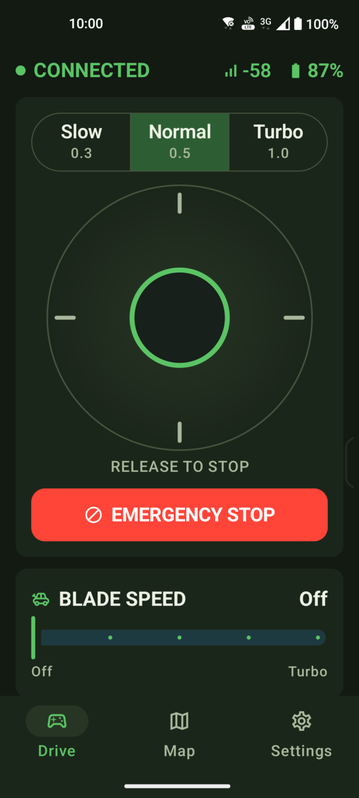
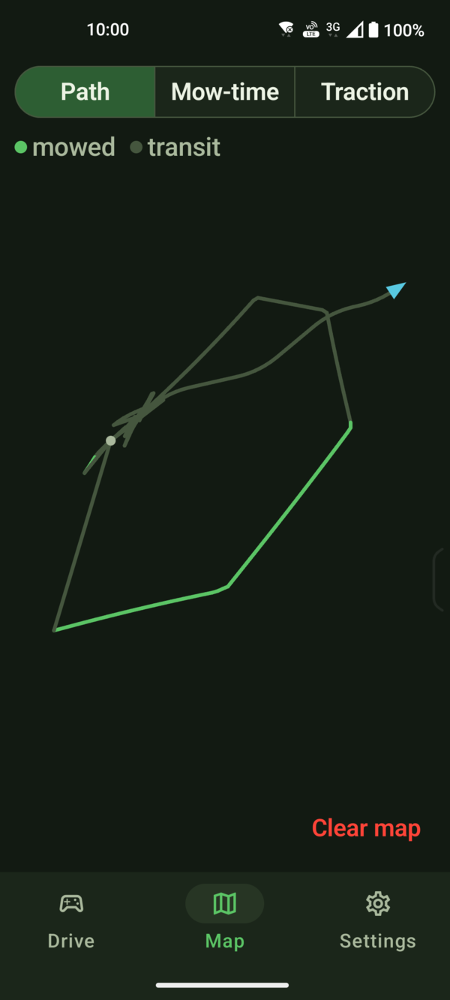
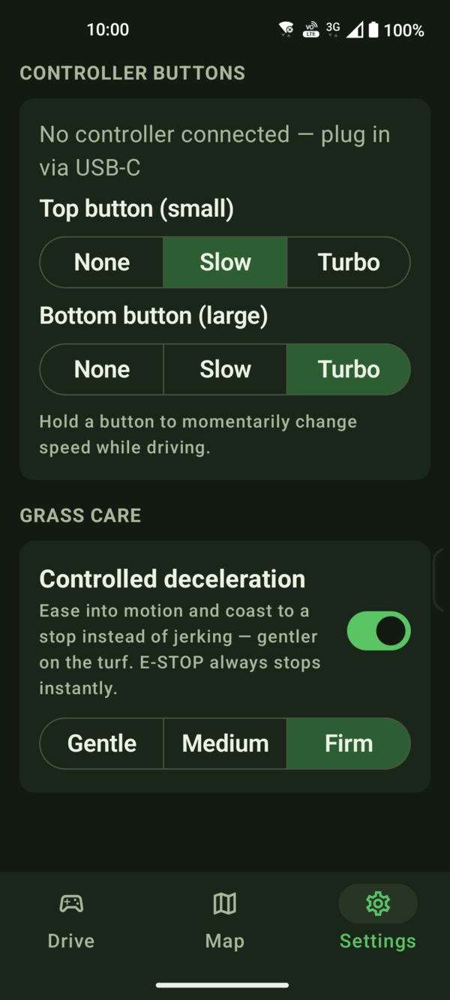

# Pradomo

**Pradomo is an Android app for manually driving a Lymow robotic lawn mower over
Bluetooth LE.** Instead of the usual split forward/turn controls, it gives you a
single 2-axis joystick — push to drive, steer as you go, release to stop — plus
USB-C gamepad support, deck and blade control, live telemetry, and a live map of
where you've driven.

It's built with Kotlin Multiplatform (Android-first), with the pure
control/protocol logic in a shared, unit-tested core.

| Drive | Map | Settings |
| :---: | :---: | :---: |
|  |  |  |

## Features

- **Single-stick driving** — one on-screen 2-axis joystick (up = forward, left/right
  = turn). It's spring-loaded: **release to stop.**
- **Speed profiles** — Slow / Normal / Turbo scaling for fine control or quick repositioning.
- **USB-C gamepad** — drive with a physical controller, with user-configurable buttons
  (e.g. hold for a momentary slow/turbo speed change).
- **Deck & blade control** — set cutting-deck height and blade speed from the app.
- **Live telemetry** — connection state, battery %, signal strength, and mower status
  in the header.
- **Yard map** — a live path map that distinguishes mowed vs. transit travel, kept
  per mower so each unit has its own track.
- **Controlled deceleration** — optional easing so the mower glides into motion and
  coasts to a stop instead of jerking. E-STOP always stops instantly.
- **Demo mode** — try the whole app against a simulated mower, no hardware required.

## ⚠️ Safety

This drives **real equipment with spinning blades.** Please read before using:

- The joystick is spring-loaded: **releasing it sends stop.** Releasing the joystick,
  backgrounding the app, and the **E-STOP** button all stop the mower immediately.
- **There is no dead-man watchdog in the mower's link.** If the Bluetooth connection
  drops while driving, the mower holds its last command until the link returns. The
  app makes a dropped link loud and obvious (red banner, locked joystick), but it
  cannot stop the mower without a connection. **Always stay ready to use the mower's
  own physical stop / power switch**, and only drive on open ground clear of people,
  pets, and obstacles.

## Build & run

Requires JDK 17+ (JDK 21 recommended), the Android SDK with `platforms;android-35`
and `build-tools;35.0.0`, and a `local.properties` pointing at the SDK
(`sdk.dir=/path/to/Android/sdk`).

```bash
# Run the shared-module unit tests (no hardware needed)
./gradlew :shared:jvmTest

# Build the debug APK
./gradlew :androidApp:assembleDebug

# Install on a connected phone (Bluetooth driving needs a REAL device —
# the emulator has no BLE radio)
./gradlew :androidApp:installDebug
```

## Driving the mower

1. Power on the mower on open ground, clear of obstacles.
2. Launch the app, grant the Bluetooth permissions, and tap **SCAN**.
3. Tap your mower to connect. The header shows connection state, mower status, and
   battery %.
4. Push the joystick to drive (up = forward, left/right = turn). **Release to stop.**
   Use **E-STOP** or background the app to stop and disconnect.

No mower handy? Tap **Try demo mode** on the connect screen to drive a simulated
mower and explore the full UI.

## Project layout

- `shared/` — Kotlin Multiplatform core (`commonMain`): the BLE protocol encoder,
  telemetry decoder, the controller (connect handshake, keepalive, safe stop), and
  the transport / input seams. Pure logic, unit-tested with golden vectors and a fake
  transport.
- `androidApp/` — the Android app: the `android.bluetooth` transport, the on-screen
  joystick, USB-C gamepad input, persistence, and the Compose UI.

## Tests

```bash
./gradlew :shared:jvmTest
```

runs the protocol and controller tests (golden byte vectors plus a fake transport).
The BLE and UI layers are verified on a physical device.

---

*Pradomo is an independent, unofficial app. It is not affiliated with, endorsed by,
or supported by the mower's manufacturer.*
